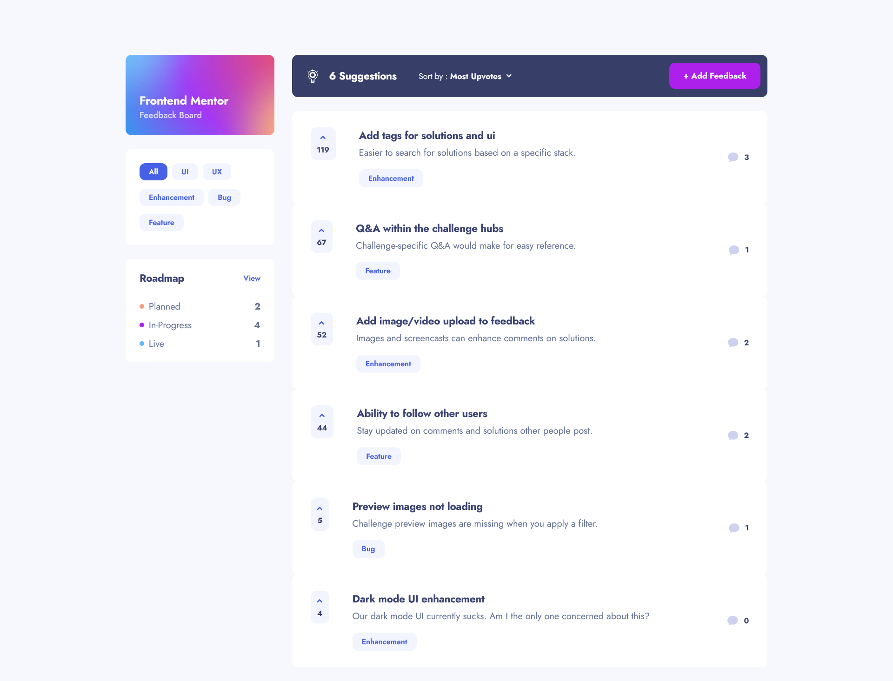

# Frontend Mentor - Product feedback app solution

This is a solution to the [Product feedback app challenge on Frontend Mentor](https://www.frontendmentor.io/challenges/product-feedback-app-wbvUYqjR6). Frontend Mentor challenges help you improve your coding skills by building realistic projects.

## Table of contents

- [Overview](#overview)
  - [The challenge](#the-challenge)
  - [Screenshot](#screenshot)
  - [Links](#links)
- [My process](#my-process)
  - [Built with](#built-with)
  - [Useful resources](#useful-resources)
- [Author](#author)

## Overview

### The challenge

Users should be able to:

- View the optimal layout for the app depending on their device's screen size
- See hover states for all interactive elements on the page
- Create, read, update, and delete product feedback requests
- Receive form validations when trying to create/edit feedback requests
- Sort suggestions by most/least upvotes and most/least comments
- Filter suggestions by category
- Add comments and replies to a product feedback request
- Upvote product feedback requests
- **Bonus**: Keep track of any changes, even after refreshing the browser (`localStorage` could be used for this if you're not building out a full-stack app)

### Screenshot

### Links

- Solution URL: [https://github.com/eljohn316/product-request-feedback-app](https://github.com/eljohn316/product-request-feedback-app)
- Live Site URL: [https://product-request-feedback-app.vercel.app/](https://product-request-feedback-app.vercel.app/)

## My process

### Built with

#### Frontend

- HTML
- CSS
- TailwindCSS
- Mobile-first workflow
- [React](https://reactjs.org/) - JS library
- [TanStack Router](https://tanstack.com/router/latest) - Modern and scalable routing for React and Solid applications
- [TanStack Query](https://styled-components.com/) - Powerful asynchronous state management for TS/JS, React, Solid, Vue, Svelte and Angular

#### Backend

- [Node.js](https://nodejs.org/en) - JavaScript runtime environment
- [Express.js](https://expressjs.com/) - Fast, unopinionated, minimalist web framework for Node.js
- [Prisma](https://www.prisma.io/orm) - Next-generation Node.js and TypeScript ORM
- [Neon Postgres](https://neon.tech/) - Serverless Postgres platform

### Useful resources

- [shadcn/ui](https://ui.shadcn.com/) - This helped me create components for the challenge, as the site offers a collection of beautifully designed example components.

## Author

- Github - [El John Bonga](https://github.com/eljohn316)
- Frontend Mentor - [@eljohn316](https://www.frontendmentor.io/profile/eljohn316)
